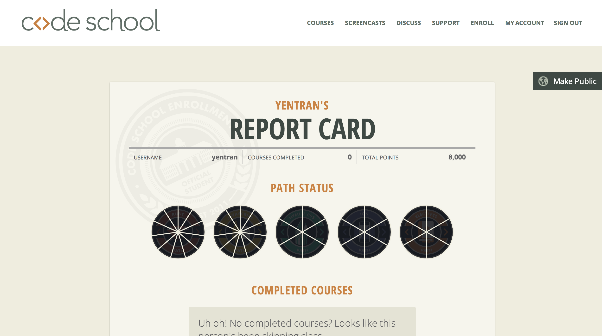

#### Include an inline screenshot of your codeschool's points from the profile page:

</a>

<!-- Modify the Markdown to include your answers. Don't delete the questions! -->

##QUIZ
* Explain which tabs support the following actions and how.
  * Realtime editing of HTML and CSS 

  The Elements tab allows realtime editing of HTML and CSS

  * Javascript Debugging

  Chrome Console tab allows for Javascript Debugging

  * Performance Optimization 

  PageSpeed panel

* What's the quick key for your OS to spawn the Dev Tools inspector?
  
  COMMAND + SHIFT + I

* Go to http://www.postmachina.com/ and analyze and tweak this nicely designed page.
  * What is the current background color for the page?  (Surprisingly, it's not just black!)
  
  #afafaf and #0b0f11

  * Tweak the background color to white.
  * Tweak the height of the side bar that contains the logo.  Shrink it down to 85px.
  * Roll over the navigation links.  When you hover over them, they dissapear.  Let's change the hover color to black instead.
  * Now take a screenshot of your new (and maybe not so improved) design.  It should match this screenshot: http://postimg.org/image/5ak1jkpl5/
  * Upload your own image to the imgs directory in the `1_Chrome_Dev_Tools` directory.  It should match the image above. The last nav link in the image above is black because the mouse was hovering there when the screenshot was taken. Do the same, and don't take a screenshot of your whole desktop, just the browser window. (This is part of the challenge.)

* For the postmachina website, why can't you tweak the color of the text "The most important things are not things"?  Please explain.

The reason why you can't tweak the color of the text is because the black background is part of the image, not part of the background.

* Go to www.ticketswizard.com and analyze the page.  
  * What is the largest image on the website?
  * Explain how you would find out this information, and list the URL of offending image here and how big it is.

 The largest image on the website is the one of Times Square in NY (http://www.ticketswizard.com/Images/Catalog/92624182-c482-4a35-8da2-4fbf2f502e94_Large_Large.png). How I figured it out:
      -Select the 'Network' tab in the Element Inspector
      -Sort the 'Size Content' column in descending order
      -The largest image will be indicated at the top of the column.
      -The size of the image is 316 KB

* Test the www.ticketswizard.com website with google's [PageSpeed Insights](http://www.ticketswizard.com/).  (You can also download the chrome plugin).  What is the easiest thing to change to optimize the website?  How many kilobytes of data can be eliminated?
  -Optimize images to reduce the size by 885.9KiB (39% reduction)
